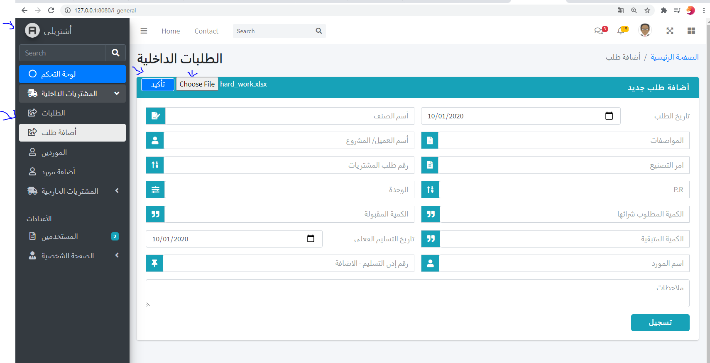

# eshtrely_demo
#### This python demo version from the app

the app will be done in PHP this is demo Python version contains (suppliers table, and database) 
and add request using upload excel sheet to the app and it will extract the data using
panda and some AI, to get the data in smoth and easy way fast, then it add it and order it
in awesome table, the desgin is not mine. (I downloaded this theme in order to give awesome UI and UX experince) 

this is flask app

#### how to setup

* Download vagrant, and Virtual box and clone the project
* inside the root folder you will find the ideal vagrantFile download and open GitBash or Linux terminal 
* cd project folder dir run vagrant up wait then run vagrant ssh then cd /vagrant
* and now run the database_setup or check the existing one, and run lotsofitems add more suppliers
* then use the main reason for the app and the AI part which is upload excelsheet and the app will understand what inside it
* and extract the data using pandas and advanced libraries and usig arabic libraries
* then the app will upload the data to the database

## this demo version in python but I'm going to build the full app in PHP soon I will share it

only the request 
